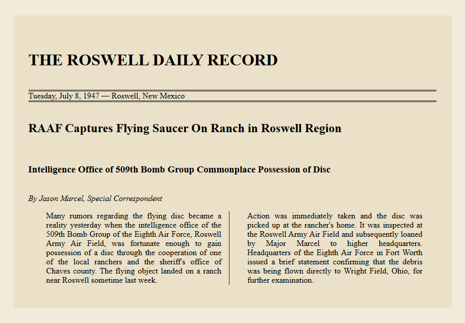

# freeCodeCamp - CSS Newspaper Article Project

  

A responsive digital newspaper article styled with modern **CSS Flexbox** and semantic HTML. This project mimics the iconic front-page layout of the *Roswell Daily Record* from July 1947, delivering a vintage "broadsheet" aesthetic with a clean, adaptable layout.

## 🚀 Demo
*(Once you enable GitHub Pages, you can paste the live link here!)*
- **Live Preview:** [View Project Live](https://josuevasquez2305.github.io/Newspaper-Article-LAB-FCC/)

## 🛠️ Features & Technical Implementation
- **Semantic HTML5:** Built using meaningful elements like `<time>`, `<address>`, and `
` to improve accessibility and structure.
- **Flexbox Layout:** Utilizes a fluid `flex-flow: row wrap` system to create a multi-column newspaper structure that automatically collapses into a single column on mobile devices.
- **Relative Units:** Employs `em` and `rem` for scalable typography and consistent layout proportions.
- **Vintage Aesthetics:** Styled with an aged paper palette (`#eae1c8` and `#f2ebd9`), typography hierarchy, text indentation, and double borders reminiscent of mid-20th-century print media.

## 🎨 Design Reference
- **Theme:** The 1947 Roswell UFO Incident controversy.
- **Color Palette:**
  - Background (Body): `#f2ebd9` (Aged paper tint)
  - Card (Newspaper): `#eae1c8` (Decomposing ink press background)
  - Primary Headlines: `#8b261e` (Controversial Wine Red)
  - Typography: `'Times New Roman'` for headers and `'Open Sans'` for the column bodies.

## 📝 User Stories Fulfilled
This project meets all the required test suites provided by the freeCodeCamp curriculum, ensuring the presence of the `.newspaper` core container along with its respective `.name`, `.date`, `.headline`, `.sub-headline`, `.author`, and `.text` child nodes.

---
*Created as part of the freeCodeCamp Responsive Web Design Certification.*